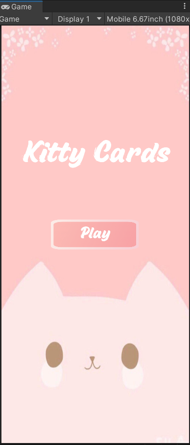
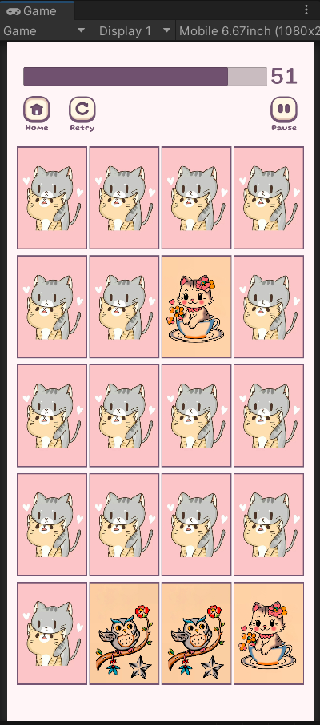
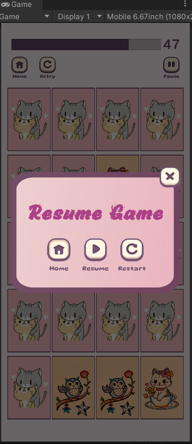
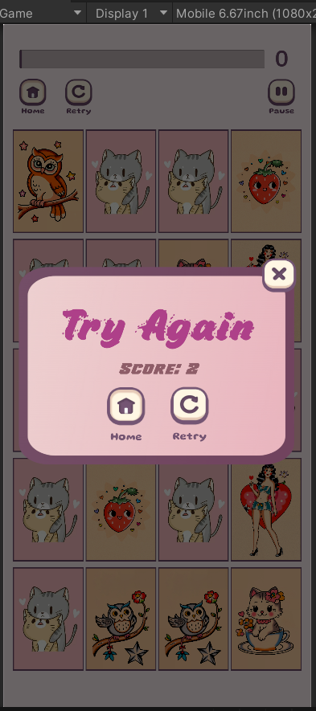
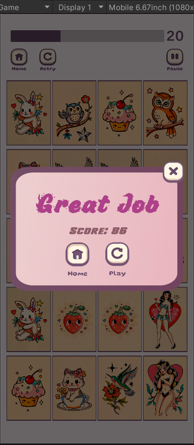

# Memory Flip-Cards-Game
Memory Flip Card Game made with Unity and C#

## Features
- Card matching system
- Timer system
- Score calculation
- Pause system
- DOTween animations
- Simple UI

## Screenshots

### Home Screen

### Gameplay

### Game Pause

### Game Over

### Game Complete

## Credits
Card Images:
- https://www.freepik.com
- https://wallpaperaccess.com

Buttons:
- https://mandinhart.itch.io/garden-cozy-ui-kit-buttons-icons